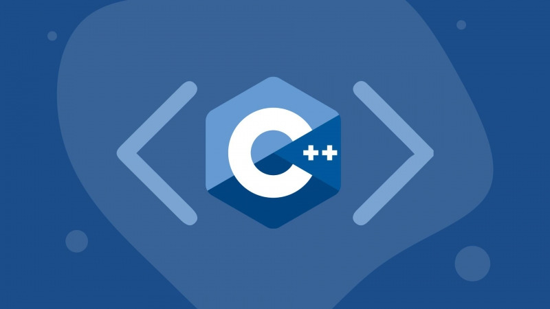
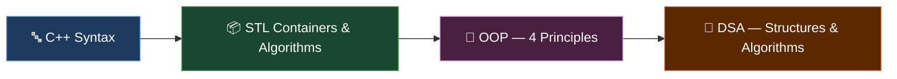

---

## Introduction

This repository documents a progressive self-study path through C++ — starting from core syntax and the Standard Template Library, moving through the four pillars of Object-Oriented Programming, and finishing with fundamental Data Structures and Algorithms. Each file is a focused exercise or reference note, written to solidify understanding rather than just compile cleanly. If you are a developer looking to revisit C++ fundamentals or build a solid foundation from scratch, this repo doubles as a practical study guide.



---
# 🚀 C++ Learning Journey

> From raw syntax to data structures — a structured, hands-on study of modern C++.


---

## 📋 Table of Contents

- [Introduction](#introduction)
- [Repository Structure](#repository-structure)
- [Part 1 — Syntax & STL](#part-1--syntax--stl)
- [Part 2 — Object-Oriented Programming](#part-2--object-oriented-programming)
- [Part 3 — Data Structures & Algorithms](#part-3--data-structures--algorithms)
- [Learning Roadmap](#learning-roadmap)
- [Getting Started](#getting-started)

## Repository Structure

```
C++/
├── cpp/
│   ├── Overview.cpp            # Full syntax cheatsheet
│   ├── Notes.cpp               # Quick-reference notes for common patterns
│   └── STL & Basic/
│       ├── 1 Mang.cpp
│       ├── 2 Vector.cpp
│       ├── 3 Mảng và Vector.cpp
│       ├── 4 Struct.cpp
│       ├── 5 Void.cpp
│       ├── 6 Struct and Void.cpp
│       ├── 7 Substr.cpp
│       ├── 8 Iterator.cpp
│       ├── 9 Set.cpp
│       ├── 10 Map.cpp
│       ├── 11 Find.cpp
│       ├── 13 Tham Chieu va Con Tro.cpp
│       ├── 14 De quy.cpp
│       └── 15 Lambda.cpp
├── OOP/
│   ├── 0. OOP.cpp
│   ├── 1. DongGoi.cpp
│   ├── 2. Ke Thua.cpp
│   ├── 3. Da Hinh.cpp
│   ├── 3.1 FO,OO,O.cpp
│   ├── 4. Truu Tuong.cpp
│   ├── 5. Tongket.cpp
│   └── Notes.cpp
└── DSA/
    ├── 1.Arrays.cpp
    ├── 2.LinkedList.cpp
    ├── 3. Stacks & Queues.cpp
    ├── 4. Hash Tables.cpp
    ├── 5. Trees.cpp
    └── 6. Graphs.cpp
```

---

## Part 1 — Syntax & STL

> 📦 `cpp/STL & Basic/`

The foundation of everything else. This section covers C++ syntax essentials and the Standard Template Library — containers, iterators, algorithms, and the string/pointer mechanics that underpin real-world C++ code.

| # | File | Topic | Key Concepts |
|---|------|-------|--------------|
| 1 | `1 Mang.cpp` | Arrays & STL Algorithms | `sort`, `stable_sort`, `partial_sort`, `find`, `find_if`, `binary_search`, `lower_bound`, `upper_bound`, `count`, `count_if`, `reverse`, `replace`, `fill`, `remove`, `unique`, `accumulate` |
| 2 | `2 Vector.cpp` | Vector Basics | `push_back`, `pop_back`, `insert`, `erase`, `resize`, `capacity` |
| 3 | `3 Mảng và Vector.cpp` | Arrays vs Vectors | Comparison, combined usage, 2D dynamic arrays |
| 4 | `4 Struct.cpp` | Struct | Declaration, initialization, field access |
| 5 | `5 Void.cpp` | Functions | `void` functions, return-type functions, parameter passing |
| 6 | `6 Struct and Void.cpp` | Struct + Functions | Combining structs with functions for structured logic |
| 7 | `7 Substr.cpp` | String Operations | `substr`, `find`, `replace`, `to_string`, `stoi` |
| 8 | `8 Iterator.cpp` | Iterators | `begin`, `end`, `auto it`, iterating over `Set` and `Map` |
| 9 | `9 Set.cpp` | Set | `insert`, `erase`, `count`, `find`, range-based for loop |
| 10 | `10 Map.cpp` | Map | `insert`, `erase`, `count`, `find`, iterator traversal |
| 11 | `11 Find.cpp` | Search Algorithms | Linear search, STL find variants |
| 13 | `13 Tham Chieu va Con Tro.cpp` | References & Pointers | `int &ref`, `int *ptr`, pass-by-reference in functions |
| 14 | `14 De quy.cpp` | Recursion | Fibonacci, Factorial |
| 15 | `15 Lambda.cpp` | Lambda Expressions | `[](int a, int b){ return a > b; }`, usage inside `sort` |

---

## Part 2 — Object-Oriented Programming

> 🧱 `OOP/`

A systematic walkthrough of all four OOP principles in C++. Each file isolates one concept before `5. Tongket.cpp` brings everything together in a comprehensive exercise.

| # | File | Topic | Key Concepts |
|---|------|-------|--------------|
| 0 | `0. OOP.cpp` | Class Basics | `class`, `private`, `public`, constructors, getters/setters, member methods |
| 1 | `1. DongGoi.cpp` | Encapsulation | Hiding data with `private`, exposing behavior through public interface |
| 2 | `2. Ke Thua.cpp` | Inheritance | `class Child : public Parent`, `protected` members, calling parent constructors |
| 3 | `3. Da Hinh.cpp` | Polymorphism | `virtual`, `override`, base-class pointer pointing to derived objects |
| 3.1 | `3.1 FO,OO,O.cpp` | Overloading & Override | Function Overloading, Operator Overloading (`operator+`), method Override |
| 4 | `4. Truu Tuong.cpp` | Abstraction | Abstract classes, pure virtual functions (`= 0`), interface pattern |
| 5 | `5. Tongket.cpp` | OOP Synthesis | Combined exercises covering all four OOP principles |

---

## Part 3 — Data Structures & Algorithms

> 🌲 `DSA/`

Core data structures implemented from scratch, paired with their fundamental algorithms. Complexity annotations are included where sorting and searching are involved.

| # | File | Topic | Key Concepts & Complexity |
|---|------|-------|--------------------------|
| 1 | `1.Arrays.cpp` | Arrays + Sorting | Bubble Sort `O(N²)`, Selection Sort `O(N²)`, Insertion Sort `O(N²)`, Merge Sort `O(N log N)` |
| 2 | `2.LinkedList.cpp` | Linked List | Node struct, singly linked list, insert at head/tail/middle, delete, traverse |
| 3 | `3. Stacks & Queues.cpp` | Stack & Queue | `push`, `pop`, `top`, `front`, `back`, `empty` — using STL `stack` and `queue` |
| 4 | `4. Hash Tables.cpp` | Hash Tables | `unordered_map`, `unordered_set`, insert `O(1)` avg, lookup `O(1)` avg, collision handling |
| 5 | `5. Trees.cpp` | Binary Search Tree | Insert, Search, Delete, InOrder / PreOrder / PostOrder traversal, tree height |
| 6 | `6. Graphs.cpp` | Graphs | Adjacency List representation, BFS (queue-based), DFS (recursive + stack), visited array |

---

## Learning Roadmap



Suggested progression through each module:

| Step | Module | Focus |
|------|--------|-------|
| ① | Syntax & Basics | Variables, control flow, functions, structs |
| ② | STL Containers | `vector`, `set`, `map`, iterators, algorithms |
| ③ | References & Pointers | Memory model, pass-by-reference, pointer arithmetic |
| ④ | OOP Foundations | Classes, encapsulation, inheritance |
| ⑤ | OOP Advanced | Polymorphism, abstraction, operator overloading |
| ⑥ | DSA — Linear | Arrays, Linked List, Stack, Queue |
| ⑦ | DSA — Non-linear | Hash Tables, Trees (BST), Graphs (BFS/DFS) |

---

## Getting Started

Clone the repository and compile any file with `g++`:

```bash
# Clone
git clone https://github.com/<your-username>/C--.git
cd C--

# Compile a single file
g++ -std=c++17 -o output "cpp/STL & Basic/1 Mang.cpp"
./output

# Compile a DSA file
g++ -std=c++17 -o output "DSA/5. Trees.cpp"
./output
```

> Requires **g++ 7+** with C++17 support. On Windows, [MinGW-w64](https://www.mingw-w64.org/) or WSL works well.

---

<p align="center">
  Built one file at a time — learning in public.
</p>
